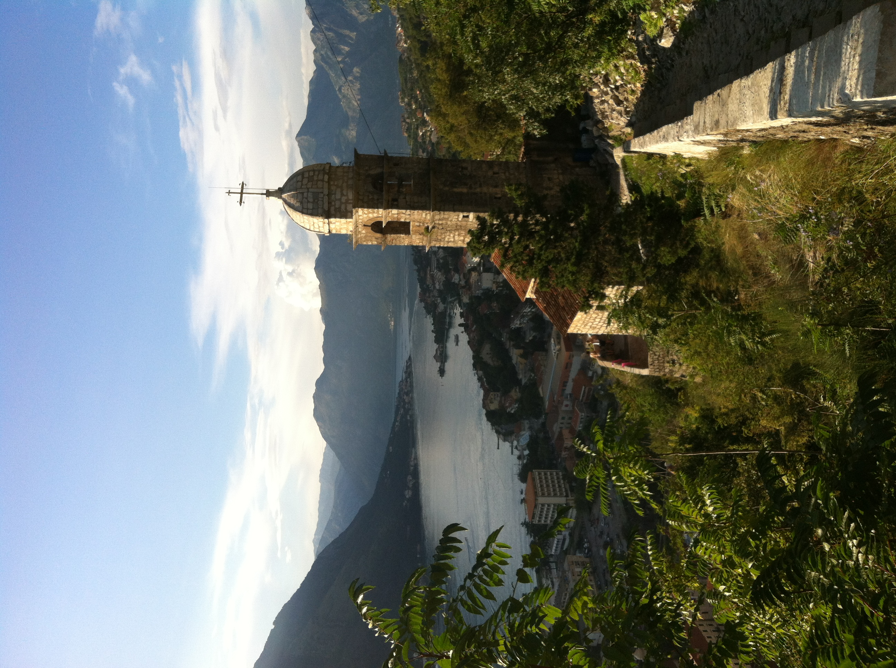
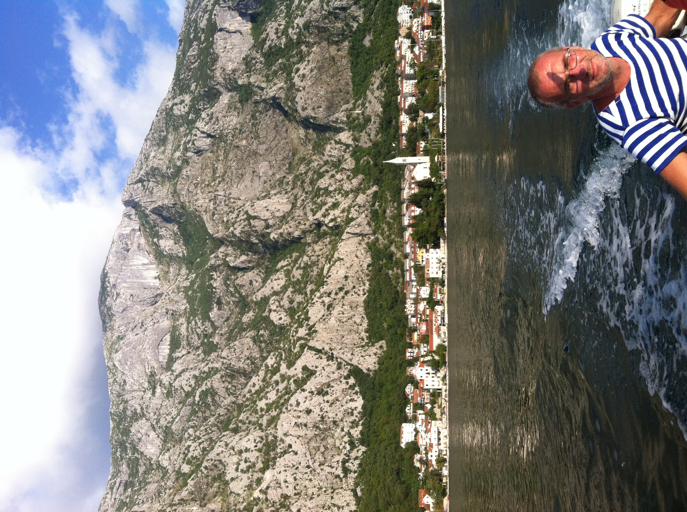
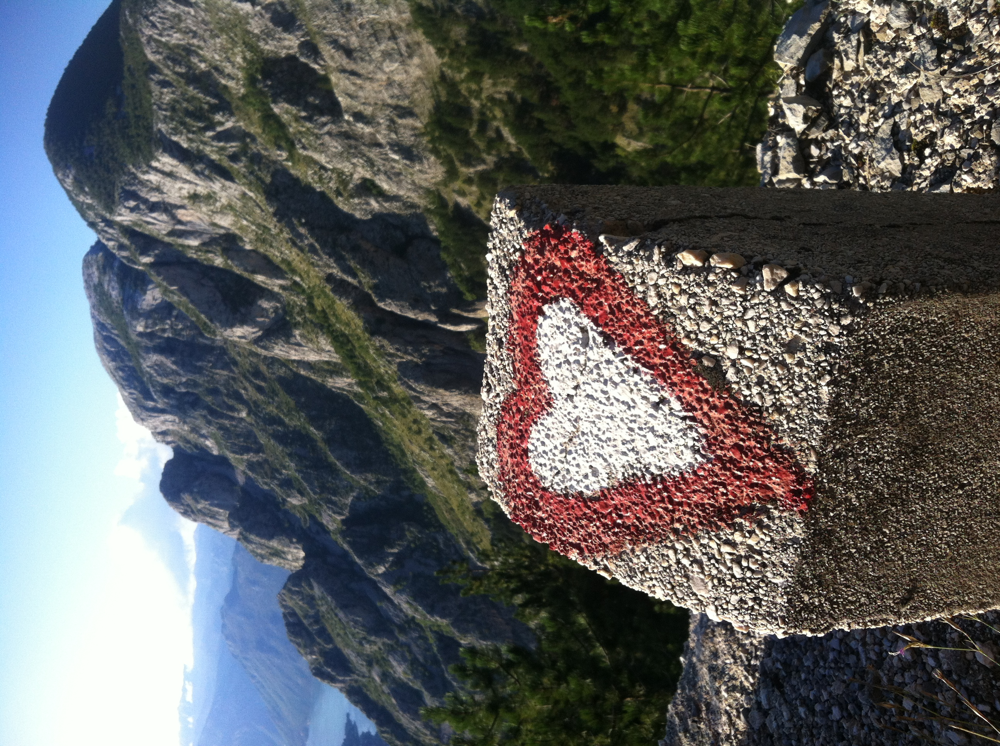
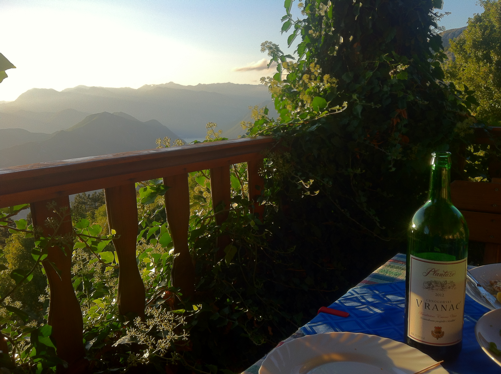

# Мой отпуск в **Черногории**

## Что сделаю в первую очередь
1. В аэропорту ищем добродушного дедулю, который довезет на колымаге
2. Находим аппартаменты и раскидываем чемодан
3. Перекус в ближайшем кафе. Там же спросить где делают "*белый картон*"
4. Оформляем этот "*белый картон*". 
> Не то что бы его там кто-то требует, но это упрощенное визовое правило, мы же добропорядочные, поэтому оформляем.
5. **Бегом на пляж!**

## Какие места посетить
* Котор. Старый город. В принципе можно погулять в первый же день. Долго торчать нет смысла.
* Подъем в гору за Котор. Маршрут от подножья крепости наверх к ресторану. [Фото 4](IMG4.JPG)
* Прокатиться в Жабляк. Можно с ночевкой
* Погулять на Черном озере в Жабляке и по другим тур.марштурам
* Прогуляться по Перасту
* Пройтись по старой Будве 
* Пошляться в окраинах Свети Стефана
* Потеряться на острове цветов

## Что надо съесть и выпить
* рыбля чорба. На заливе лучше нет еды для русского) рыбный суп
* мушуле на бузару. Свежие мидии сварены в большой кастрюле
* любую рыбу или других морских гадов. По желанию или рекомендации официанта или повара. Да, иногда можно подойти к повару и узнать чего может коронного исполнить
* пить разливное пиво Никшичко. Это местное. Немного дороговато, но оно того стоит.
* фастфуд. любой, едим, потому что это не тот фастфуд к которому привыкли.
* пицца. В городе Котор в ресторанах мало где хорошо кормят. Там лучше пицца!
* В Которе есть **рынок**, берем там свежих овощей, фруктов, ягод. Не забываем взять пршут, лучше нарезанный и сыры. А потом еще покупаем там же ягодное вино, например ежевичное. И **устраиваем праздник живота!**
* также есть магазины **Cogimar**. Там берем сколько влезет свежих королевских креветок, варим дома. Балдеем, с пивом/вином

## Фоточка на память

